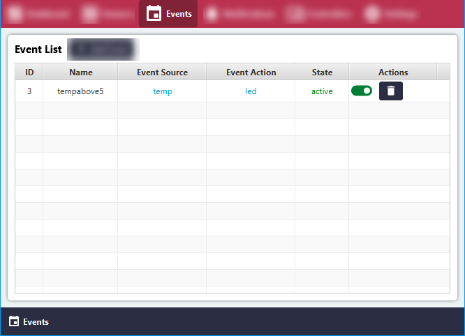
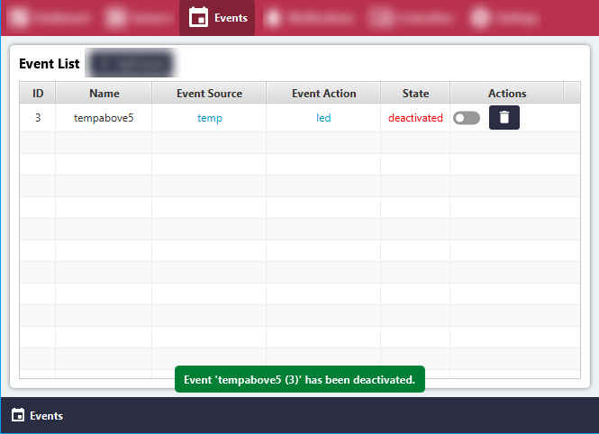
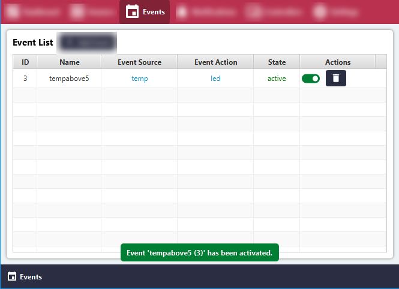

# Activate or Deactivate Local Event

#### Click the 'Events' menu item.
All Events will be listed in the 'Sensor List' area.

#### Click or toggle the switch in the 'Actions' section to deactivate the event.

#### Click or toggle the switch in the 'Actions' section to activate the event.

