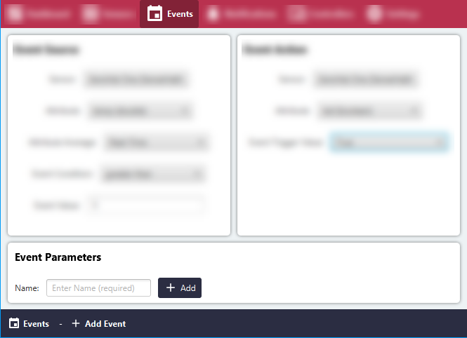

# Add new Local Event

#### Prerequisite: At least one Input and one Output Sensor Attribute must be validated and in an active state!

#### Click the 'Events' menu item.

#### Click the 'Add Event' button.

#### Fill out the Event Source section. The Event Source is the data stream to be monitored by the rules engine for fulfillment.
In this example, the event will be fulfilled in case the temperature reading
goes above 5.

#### Fill out the Event Action section. The Event Action is the action to be taken when the event is fulfilled.
In this example, the value 'True' will be set for the LED light, meaning it will turn on the light.

#### Enter a descriptive name for the event.

#### Click 'Add' to save the event.

#### The Event has been saved successfully.

#### Important: For the rules engine to start, it is necessary to activate the event!

