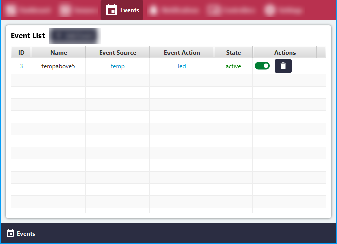
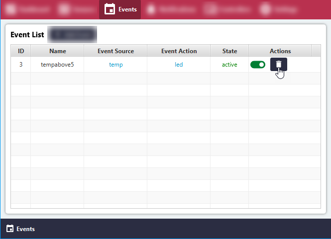
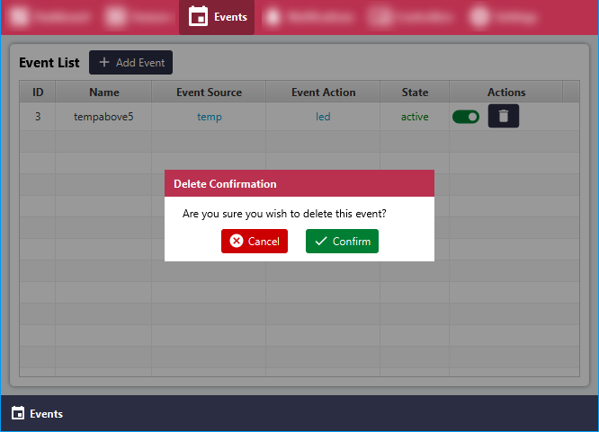
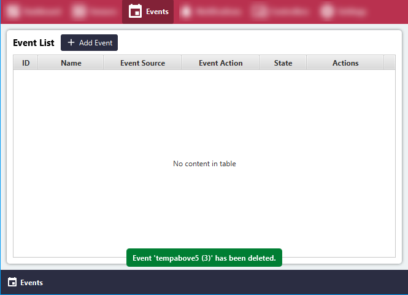

# Delete Local Event

#### Click the 'Events' menu item.
All Events will be listed in the 'Sensor List' area.

#### Click the 'Delete' button for the relevant Event.

#### Click the 'Confirm' button in the pop-up.

#### The Event has been deleted successfully.

