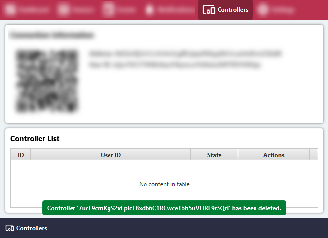

# Remove connected Remote Controller

#### Note: Remote Controllers will be available soon!

#### Click the 'Controllers' menu item.

#### Click 'Delete' to remove and block the connection.

#### Confirm the deletion in the pop-up.

#### The connection has been successfully removed.

