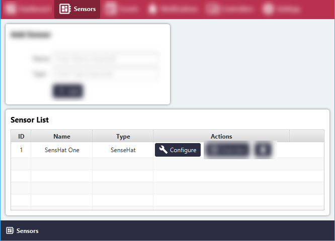
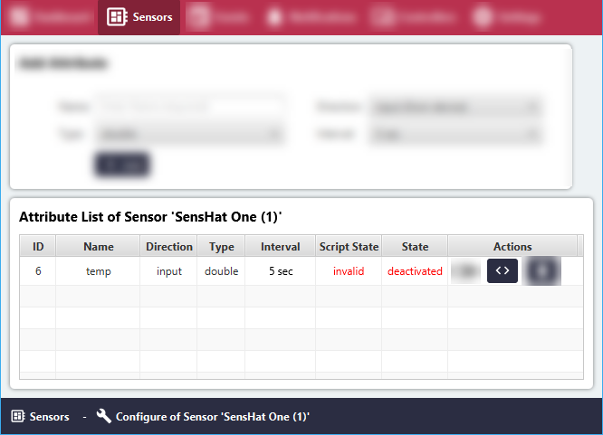
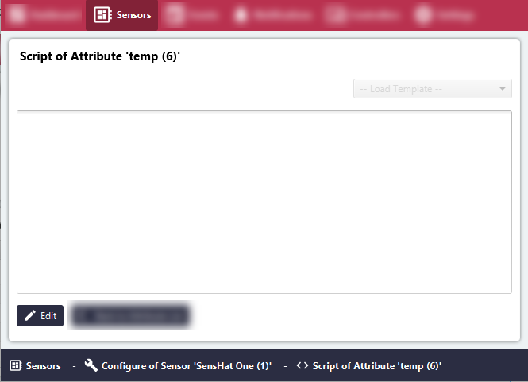
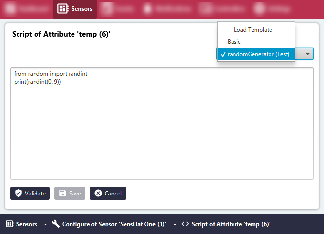
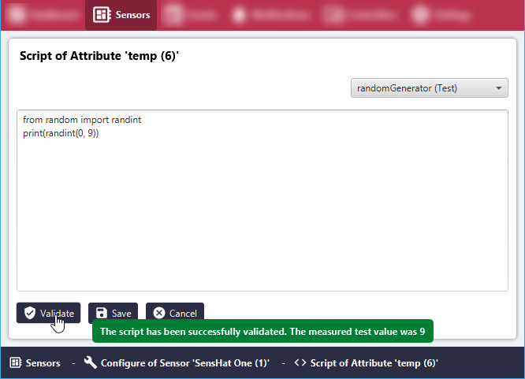
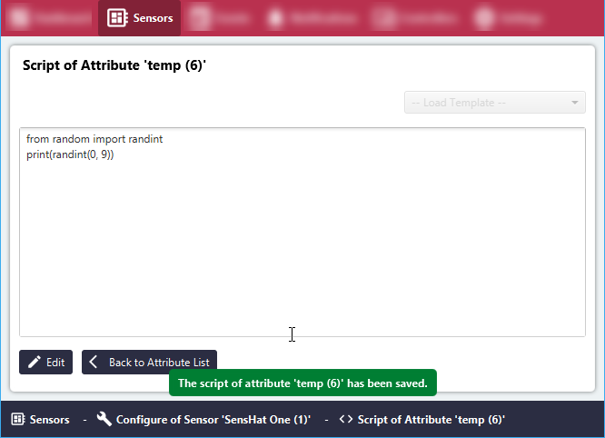

# Create Input Sensor Attribute Script

#### Click the 'Sensors' menu item.
All Sensor Groups will be listed in the 'Sensor List' area.

#### Click the 'Configure' button for the relevant Sensor Group.

#### Click the '< >'(Script) button.

#### Click the 'Edit' button below the text field to start editing.

#### Use a template from the top right corner, or add your own script.

#### Click the 'Validate' button to validate the script.

#### Save the changes by clicking the 'Save' button.

The Input Sensor Attribute Script has now been validated and saved.

#### Click 'Back to Attribute List' to return to the list of attributes.
