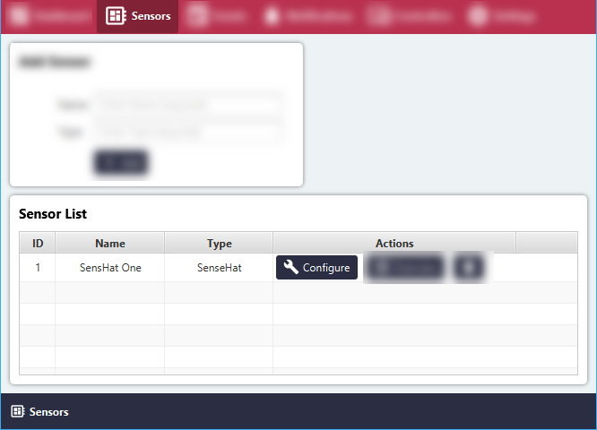
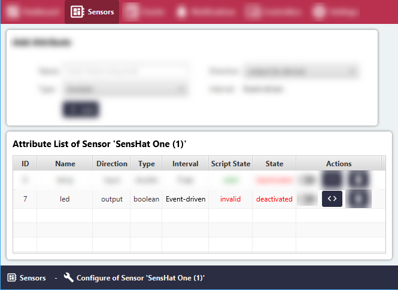
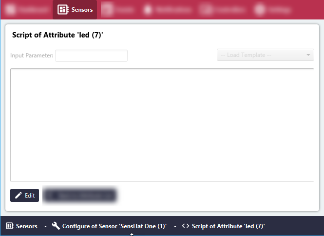
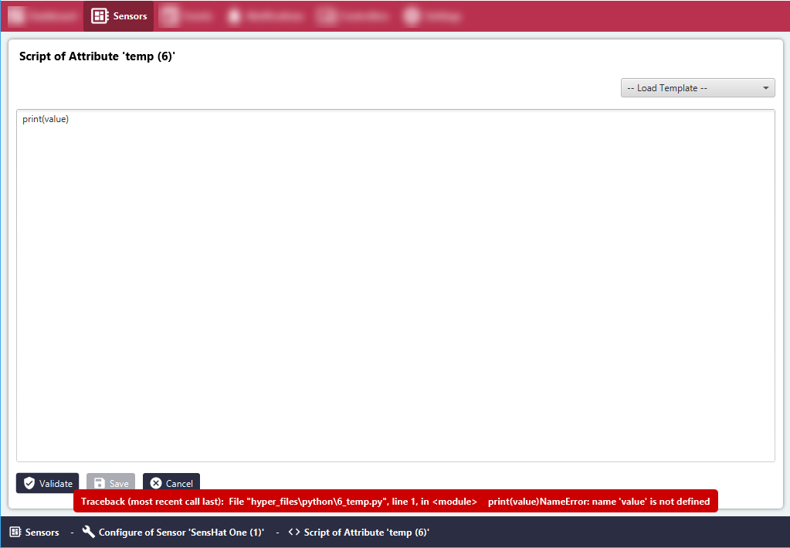
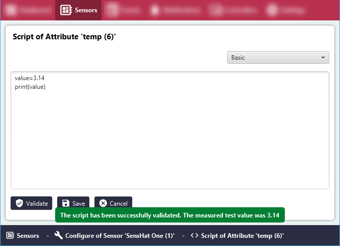

# Validate Sensor Attribute Script

#### Click the 'Sensors' menu item.
All Sensor Groups will be listed in the 'Sensor List' area.

#### Click the 'Configure' button for the relevant Sensor Group.

#### Click the '< >'(Script) button.

#### Click the 'Edit' button below the text field to start editing.

#### Add own Python script.

#### Failed validation: Error case
The compiler will provide information about the error. In this case, the variable 'value' was not defined.

#### Successful validation

