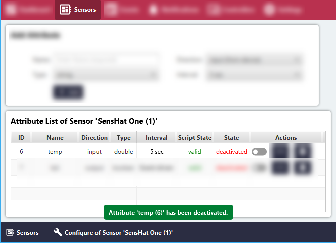

# Activate or Deactivate Sensor Attribute State

#### Click the 'Sensors' menu item.
All Sensor Groups will be listed in the 'Sensor List' area.

#### Click the 'Configure' button for the relevant Sensor Group.

#### To be able to activate the Sensor attribute make sure the Sensor Attribute Script is already valid!

#### To activate, in the 'Actions' Column, click or toggle the grey switch.

#### To deactivate, In the 'Actions' Column, click or toggle the green switch.

