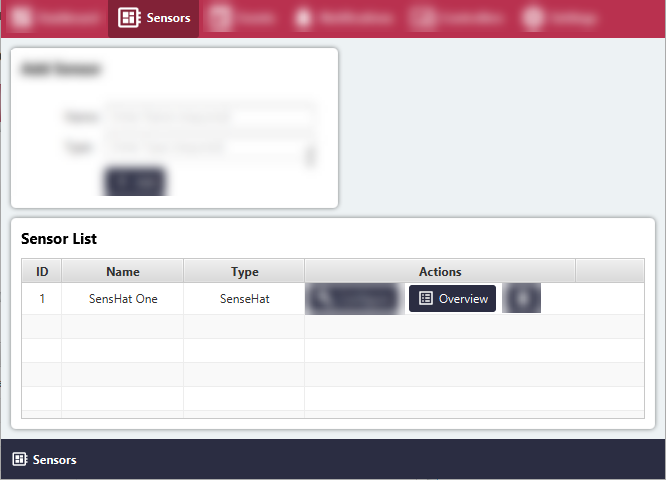
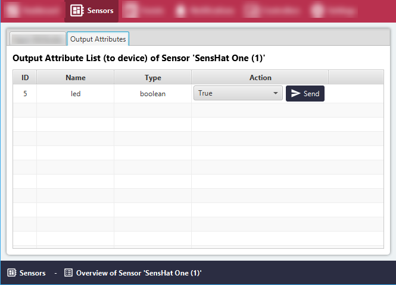

# Ad-Hoc Action with Output Sensor Attribute

#### Click the 'Sensors' menu item.
All Sensor Groups will be listed in the 'Sensor List' area.

#### Click the 'Overview' button for the relevant Sensor Group.

#### Switch to the 'Output Attribute' tab.

#### Select the value to set and click the 'Send' button.

