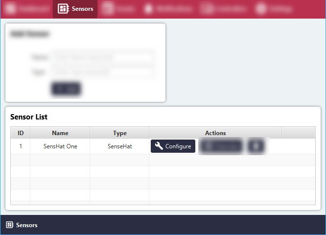
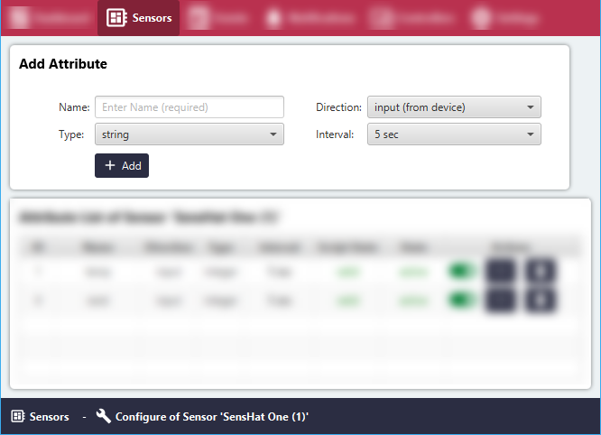

# Add new Sensor Attribute

#### Click the 'Sensors' menu item.
All Sensor Groups will be listed in the 'Sensor List' area.

#### Click the 'Configure' button for the relevant Sensor Group.

#### In the 'Add Attribute' section, add and select the relevant properties and click 'Add'.

#### Sensor Attribute Properties
- **Name**: Name of Sensor Attribute
- **Direction**: Input (from sensor to device), Output (from device to sensor)
- **Type**: Type of data to be collected (string, boolean, integer, double)
- **Interval**: Interval between readings (5-59 sec range)

The new Sensor attribute will appear in the section below the 'Add Attribute' area.
