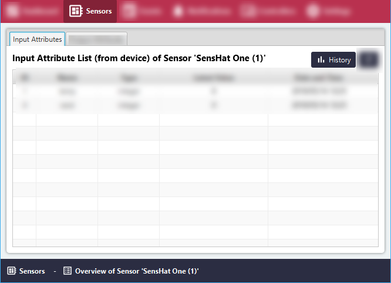
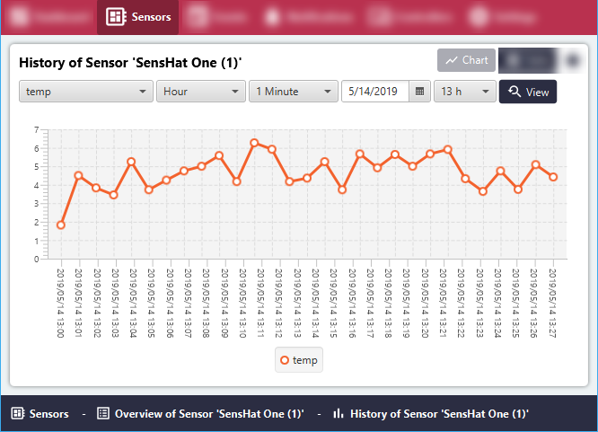

# Charts for Input Sensor Attributes

#### Click the 'Sensors' menu item.
All Sensor Groups will be listed in the 'Sensor List' area.

#### Click the 'Overview' button for the relevant Sensor Group.

#### In the 'Input Attributes' tab, click the 'History' button.

#### Select the Attribute, (Time) Window, Average, Date, and Time, then click the 'View' button.
The Graph may be refreshed by clicking 'View' again.

