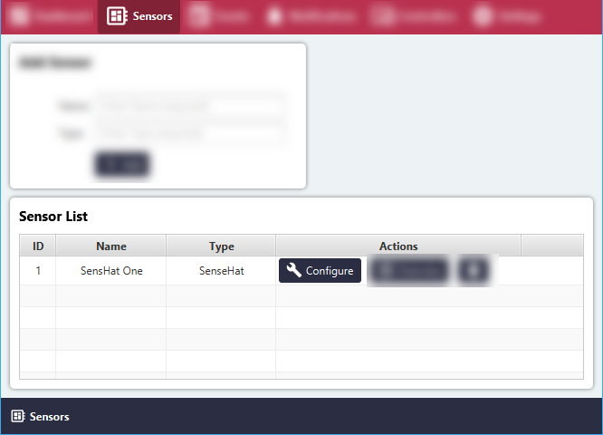
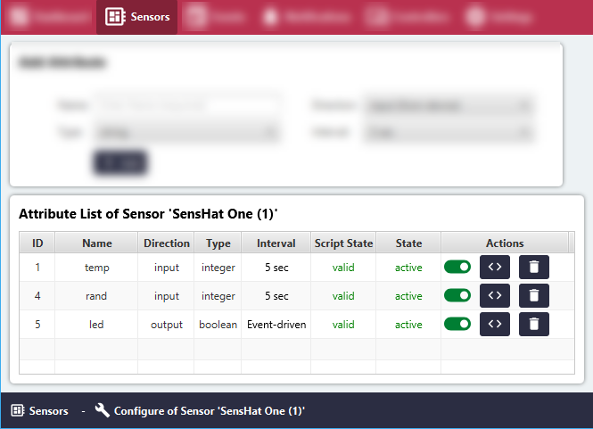

# List all Sensor Attributes

#### Click the 'Sensors' menu item.
All Sensor Groups will be listed in the 'Sensor List' area.

#### Click the 'Configure' button for the relevant Sensor Group.

All Sensor Attributes of the Sensor Groups will be listed in the 'Sensor Attribute' area.

