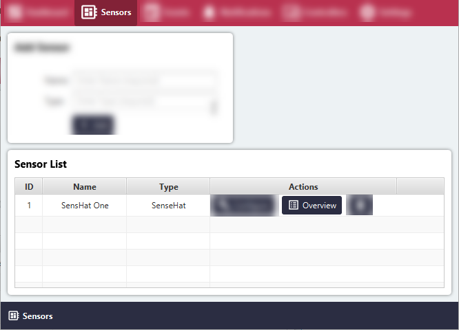
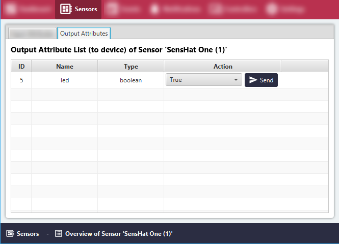

# List Output Sensor Attributes

#### Click the 'Sensors' menu item.
All Sensor Groups will be listed in the 'Sensor List' area.

#### Click the 'Overview' button for the relevant Sensor Group.

#### Switch to the 'Output Attributes' tab.

All Output Sensor Attributes of the Sensor Group will be listed in the 'Sensor Attribute' area.

