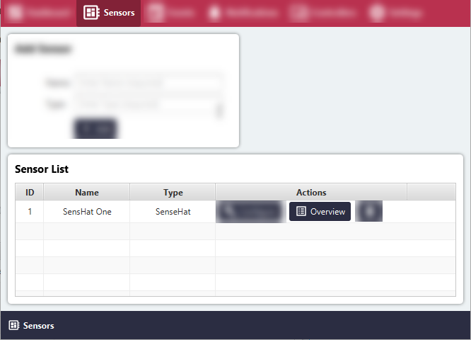
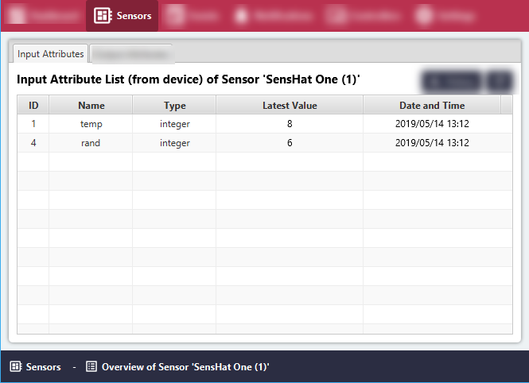

# List readings of Input Sensor Attribute History in a Table

#### Click the 'Sensors' menu item.
All Sensor Groups will be listed in the 'Sensor List' area.

#### Click the 'Overview' button for the relevant Sensor Group.

All Input Sensor readings of the Sensor Group will be listed in the 'Input Attribute List' area.

