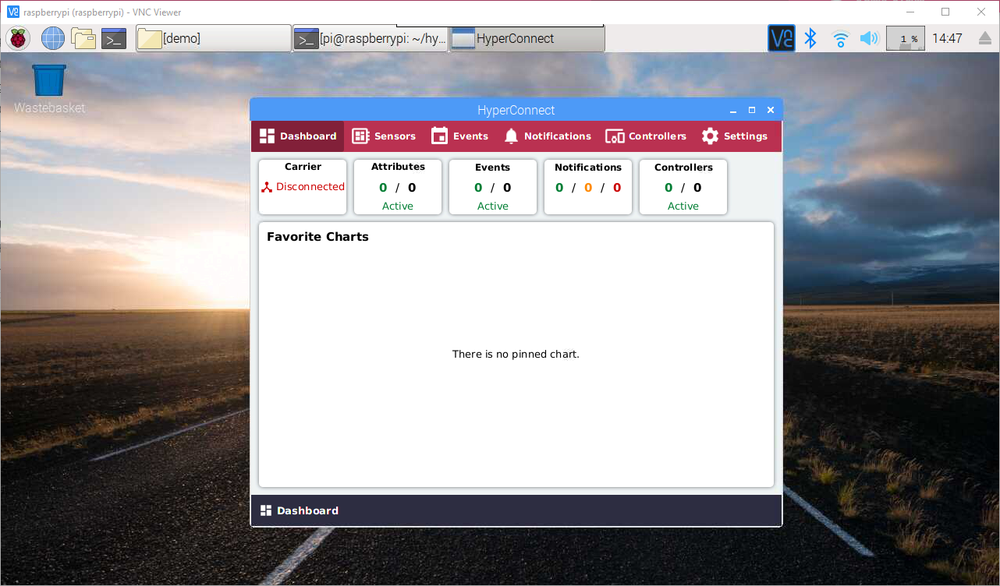

# HyperConnect on Raspberry Pi

The Raspberry Pi is a widely used, small, single-board computer.

Although several Operating Systems are supported, HyperConnect advises the use of the [Raspbian OS](https://www.raspberrypi.org/downloads/raspbian/).

## Prerequisites
- Raspberry Pi Board
- Raspbian OS installed
- Monitor, Keyboard, Mouse
- Direct or remote access (VNC)

## Installation

- Install Git
```
sudo apt-get install git
```

### Programming languages

#### Open a Terminal

- Update
```
sudo apt-get update
```
- Install Java
```
sudo apt-get install openjdk-8-jdk
```
- Install JavaFX
```
sudo apt-get install openjfx
```
- Install Python
```
sudo apt-get install python3
```

### Use Prebuilt Binaries

#### Download from the GitHub repository.
```
git clone https://github.com/cyber-republic/hyperconnect-edge-client
```

#### Change directory. Replace YOUR-PATH with your local path to the directory.
```
cd YOUR-PATH/hyperconnect-edge-client/demo
```

#### Start the HyperConnect Edge Client as Administrator using 'sudo' .
```
sudo java -jar hyper_connect.jar
```
It may take 5-15 seconds at start for the front-end to load. Please be patient.


