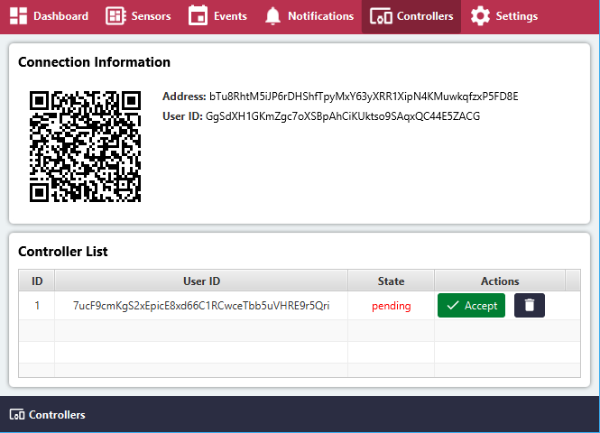
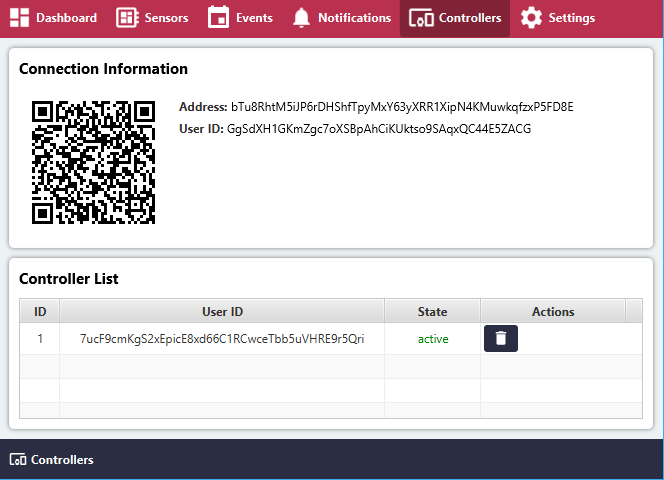

# Controllers

### Controller Information
- **QR Code**: Carrier Address of Device displayed as a QR Code
- **Address**: Carrier Address of Device
- **User ID**: Carrier User ID of Device

### Controller List
- **ID**: Automatically assigned unique ID
- **User ID**: Carrier User ID of Remote Controller
- **State**: State of connection / request with Remote Controller
- **Accept**: Accept Remote Controller connection
- **Delete**: Delete Remote Controller connection

