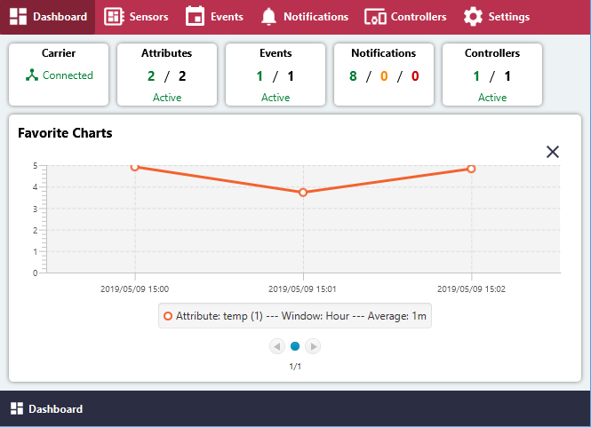

# Dashboard

**Carrier** - Status: Connected / Disconnected

**Attributes** - Active / Total Count

**Events** - Active / Total Count

**Notifications** - Info / Warning / Error Count

**Controllers** - Active / Total Remote Controllers

**Favorite Charts** - Charts of Sensor Attributes may be pinned to Dashboard
