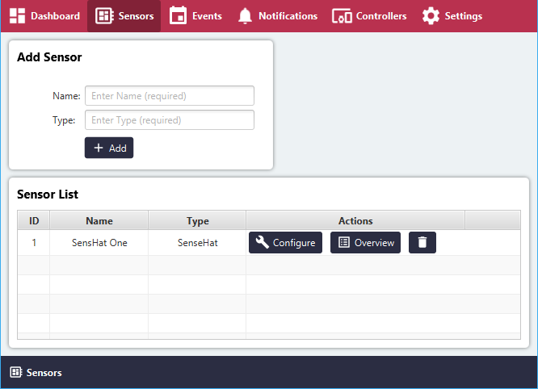
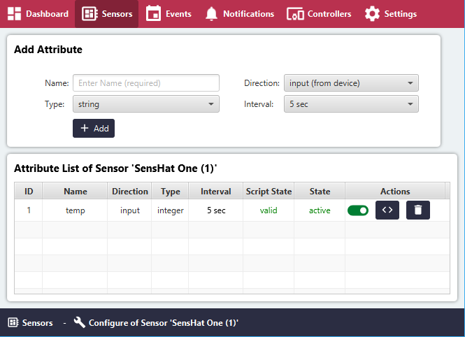
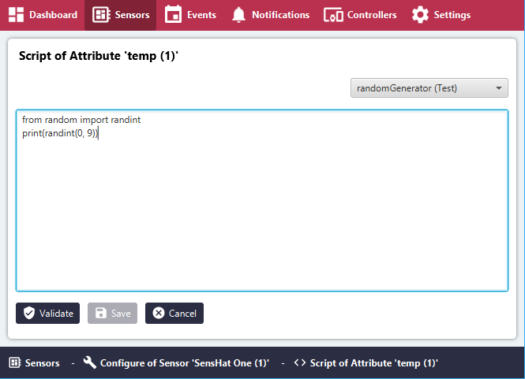
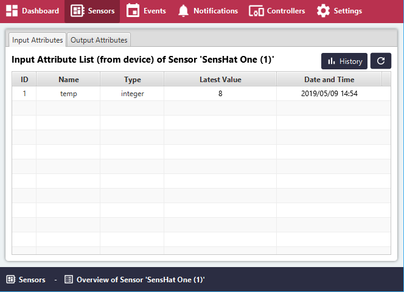
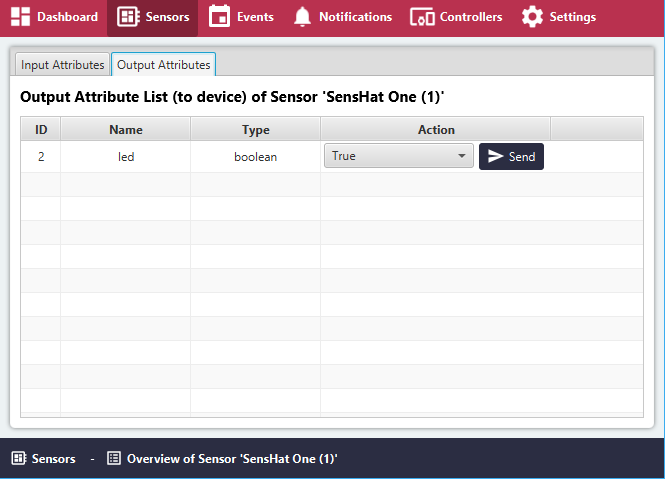
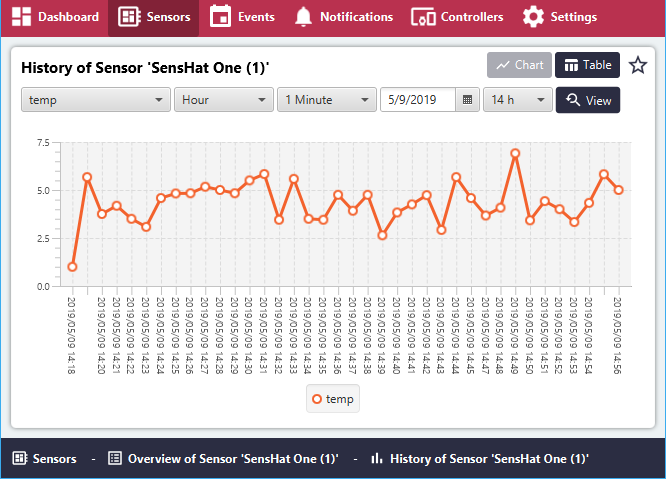
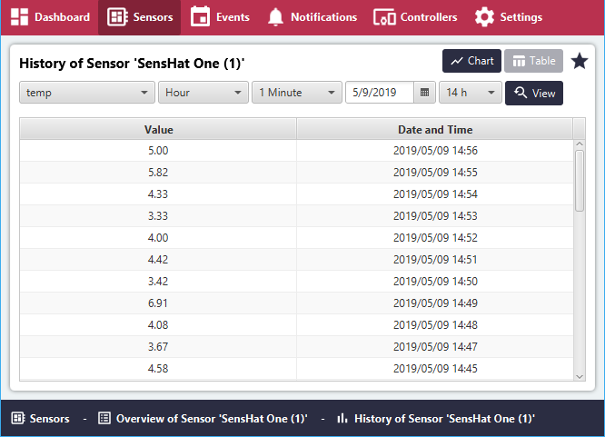

# Sensors

## Sensor Groups

### Add Sensor
- **Name**: Name of Sensor
- **Type**: Type of Grouping ( for example by location, manufacturer... )

### Sensor List
- **ID**: Automatically assigned unique ID
- **Name**: Name of Sensor
- **Type**: Type of Grouping
- **Configure**: Manage Sensor Attributes and Scripts
- **Overview**: Input / Output Attributes, Charts, History
- **Delete**: Remove Sensor Group, Attributes and Sensor Scripts

## Configure - Sensor Attributes

### Add Sensor Attribute
- **Name**: Name of Sensor Attribute
- **Direction**: Input (from sensor to device), Output (from device to sensor)
- **Type**: Type of data to be collected (string, boolean, integer, double)
- **Interval**: Interval between readings (5-59 sec range)

### Sensor Attribute List
- **ID**: Automatically assigned unique ID
- **Name**: Name of Sensor Attribute
- **Direction**: Input (from sensor to device), Output (from device to sensor)
- **Type**: Type of data to be collected (string, boolean, integer, double)
- **Interval**: Interval between readings / Event-driven if 'Direction' is 'Output'
- **Script State**: valid / invalid
- **Sensor Attribute State**: active / deactivated (Script state must be valid to activate)
- **Control Attribute State**: Activate or deactivate Sensor Attribute state
- **Manage Sensor Script**: Create, Manage, Validate Sensor Attribute Script
- **Delete**: Remove Attribute and Sensor Script

## Sensor Script

### Python Compiler
####Display Mode
- **Edit**: Enter Edit mode
- **Back to Attribute List**: Go to Attribute List

####Edit Mode (Input Direction)
- **Load Template**: Pre-defined code templates
- **Code**: Modifiable code with Syntax checking
- **Validate**: Validation of Python Script
- **Cancel**: Cancel changes, leave edit mode

####Edit Mode (Output Direction)
- **Input Parameter**: Test parameter required for validation
- **Load Template**: Pre-defined code templates
- **Code**: Modifiable code with Syntax checking
- **Validate**: Validation of Python Script
- **Cancel**: Cancel changes, leave edit mode

## Overview - Input Attributes

### Input Attribute List
- **ID**: Automatically assigned unique ID
- **Name**: Name of Sensor Attribute
- **Type**: Type of data to be collected (string, boolean, integer, double)
- **Latest Value**: Latest value read from sensor (click Refresh)
- **Date and Time**: Date and time of latest value readings

- **History**: See charts or table view of collected data
- **Refresh**: Refresh Latest Values in list

## Overview - Output Attributes

### Output Attribute List
- **ID**: Automatically assigned unique ID
- **Name**: Name of Sensor Attribute
- **Type**: Type of data to be collected (string, boolean, integer, double)
- **Action**: Assign temporary Ad-Hoc value to output

## Overview - Graphs

- **Chart**: View Data in Chart
- **Table**: View Data in Table view
- **Favorite**: Mark Selection as Favorite, will be shown on Dashboard

- **Attribute**: Sensor Attribute to view
- **Window**: Time Window for data to view
- **Average**: Averaged values
- **Date**: Date of readings
- **Hour**: Time 'Window' dependent (Timezone dependent)
- **View**: Display with selection or Refresh

## Overview - Table View History

- **Attribute**: Sensor Attribute to view
- **Window**: Time Window for data to view
- **Average**: Averaged values
- **Date**: Date of readings
- **Hour**: Time 'Window' dependent (Timezone dependent)
- **View**: Display with selection or Refresh

- **Value**: Read Value
- **Date and Time**: Date and Time of reading
