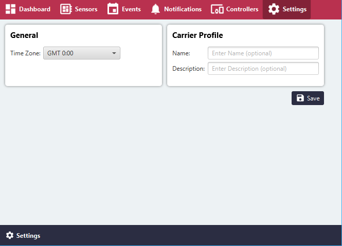

# Settings

### General
- **Time Zone**: Time Zone in which the Device is located

### Carrier Profile
- **Name**: Optional Name of Edge Client (Carrier relevant)
- **Description**: Optional Description of Edge Client (Carrier relevant)
