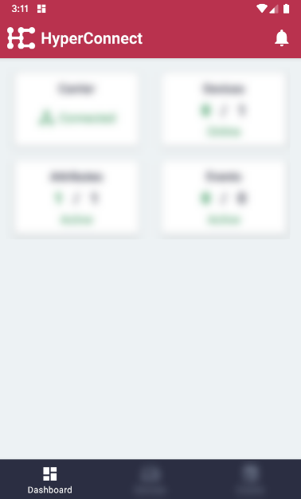
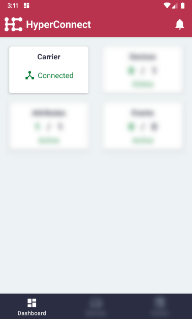

# Display Carrier Connection Status

The Connection Status shows if the Remote Controller is connected to the peer-to-peer network.

#### Click the 'Dashboard' menu item on the bottom left.

#### The carrier connection will be displayed.

