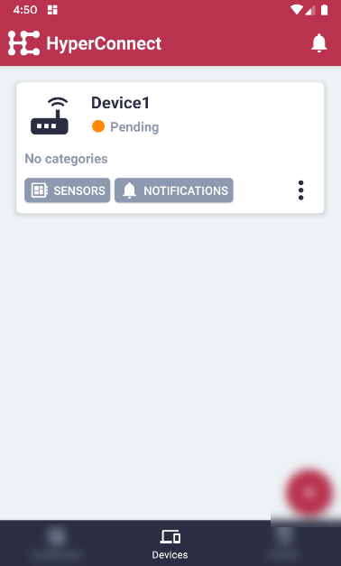
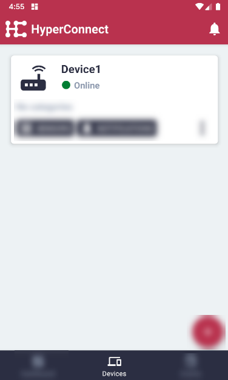

# Connect Edge Client to Remote Controller

#### Click the 'Devices' menu item on the bottom in the middle.

#### Click the 'Add' button on the bottom right.

#### Enter a descriptive Device Name.

#### Either scan the QR Code that is displayed on the Edge Client, or add the Edge Client Address manually.

#### On the Edge Client (running on the IoT Device), open the 'Sensors' menu to see the address and the QR code containing the Address.

#### With the Remote Controller (mobile application) scan the QR code displayed on the Edge Client (running on the IoT Device) or copy and paste the address manually to the Remote Controller.

#### (If added manually) click the "Finish" button to connect.

#### On the Remote Controller, the connection will show as 'Pending'.

#### On the Edge Client, the connection will also show as 'Pending'.

#### On the Edge Client, click 'Accept' to enable connection.

#### On the Remote Controller, the device will now be shown as 'Online'

#### Note: This process must only be done once for each Edge Client. Once the connection is accepted, connection will automatically be set up when both the Edge Client and Remote Controller are started and have internet access.
