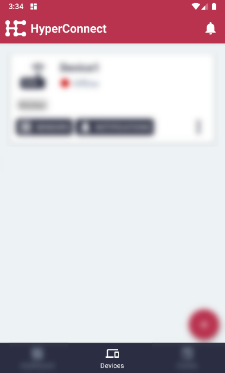
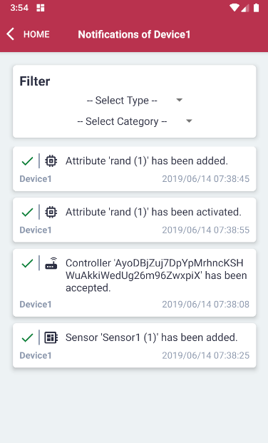

# Connect Edge Client to Remote Controller

#### Click the 'Devices' menu item on the bottom in the middle.

#### For the relevant Device, click 'Notifications'.

#### The Notifications will be displayed.

#### Optionally, the notifications can be filtered by type and category.
