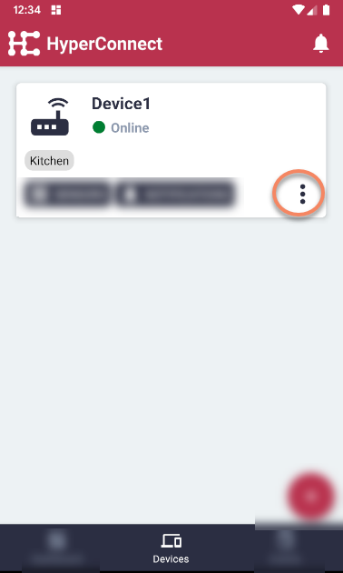
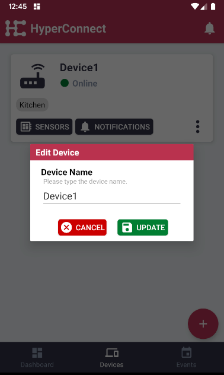

# Edit Device Name

#### Click the 'Devices' menu item on the bottom in the middle.

#### Click the 'More Options' button for the relevant device.

#### Then, click 'Edit'.

#### The current name will be shown.

#### Edit the name as necessary.

#### Click 'Update' button.

#### The device name has now been changed.
