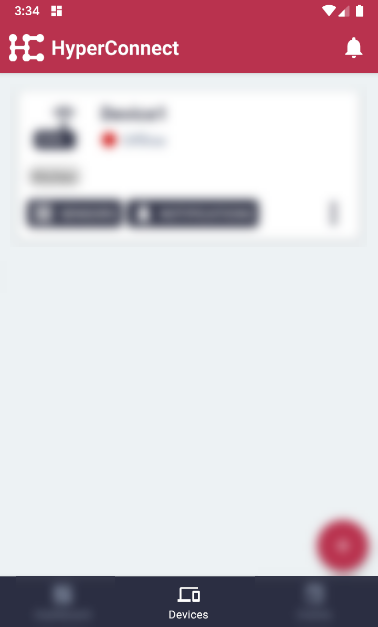
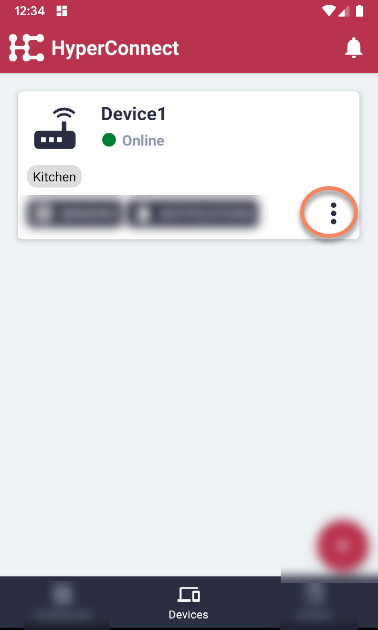
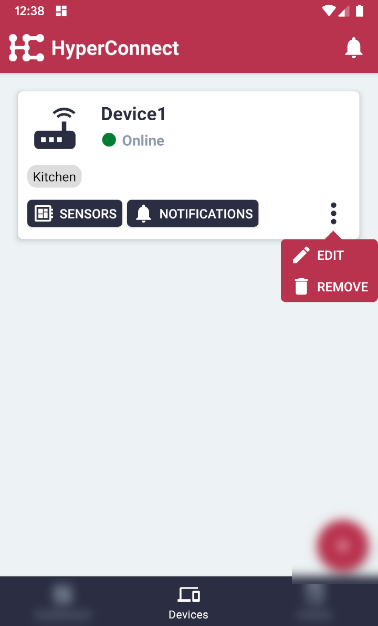
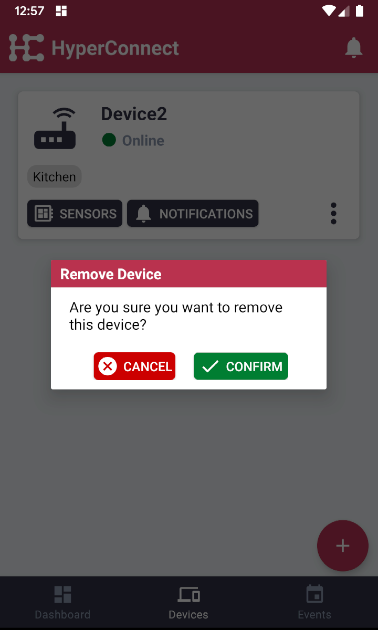

# Remove Device

#### Click the 'Devices' menu item on the bottom in the middle.

#### Click the 'More Options' button for the relevant device.

#### Then, click 'Remove'.

#### In the pop-up, click 'Confirm'.

