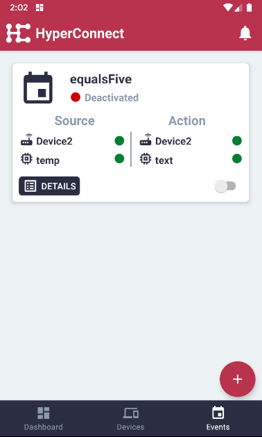
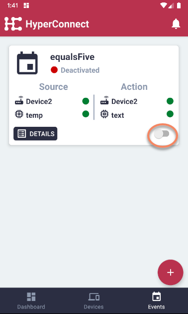
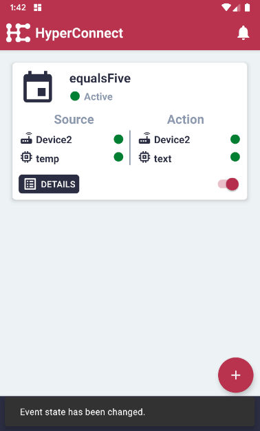
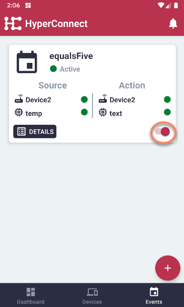
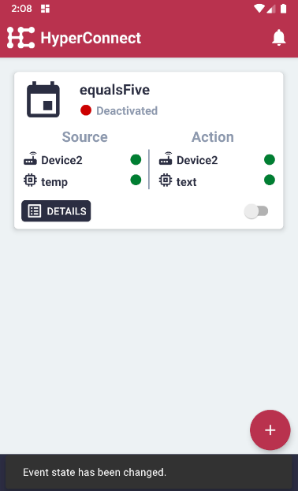

# Activate or Deactivate Events

#### Please follow the steps described in 'Display All Events' first.

#### To activate an event, toggle the button on the right bottom corner.

#### The event is now active.

#### To deactivate an event, toggle the button on the right bottom corner.

#### The event has now been deactivated.

