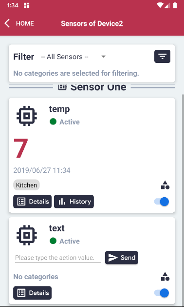
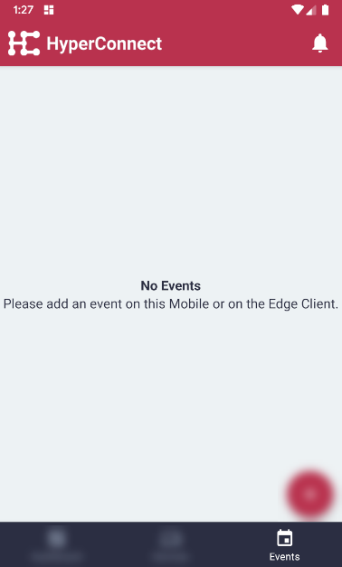
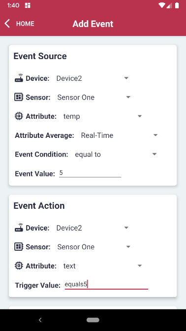
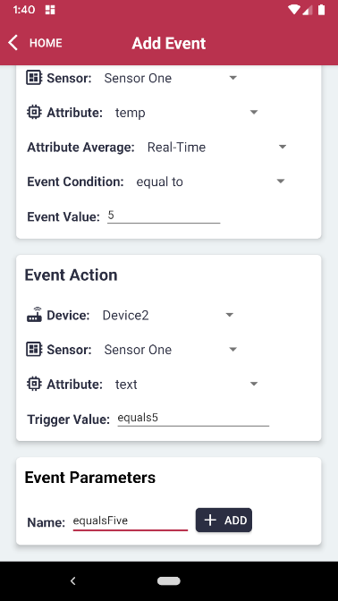
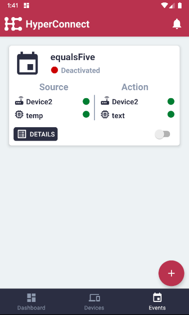
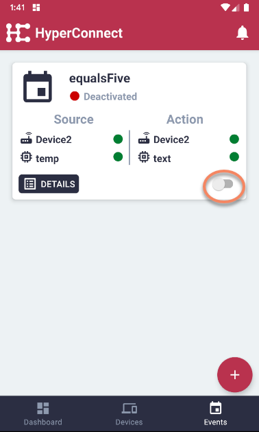
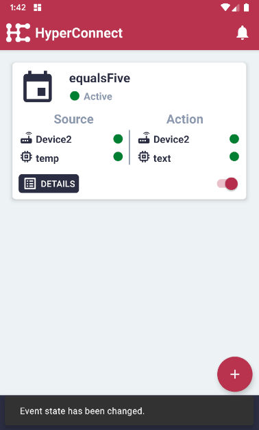

# Add New Event

#### Note: at least 1 input and 1 output Sensor Attribute must already be configured and active.

#### Click the 'Events' menu item on the bottom on the right.

#### Click the '+ Add' button on the bottom right.

#### Edit the fields as necessary.

#### Add a descriptive event name and click the 'Add' button to save the event.

#### The new event will be added to the overview, but as deactivated by default.

#### Toggle the button on the right bottom corner to activate the event.

#### The event is now active.

