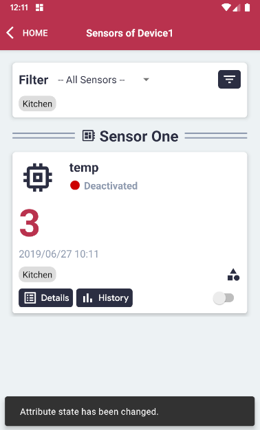

# Activate or Deactivate Sensors

#### Note: Activating or deactivating the sensors via the Remote Controller updates the Edge Client's sensors.

#### Please follow the steps described in the section 'Display Sensors of a Device' first.

#### On the right bottom side of the Sensor area, toggle the button to activate or deactivate the sensor.

#### The status of the sensor will be updated.

