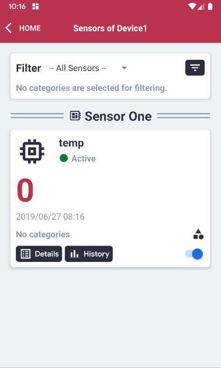
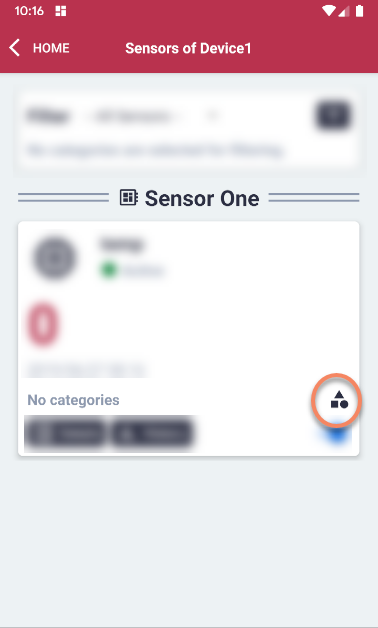
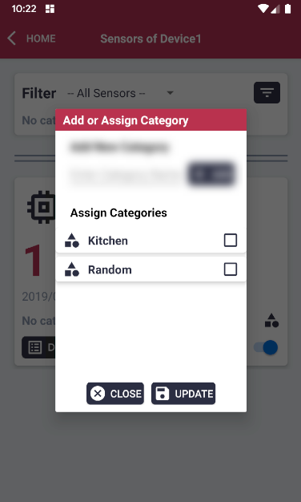
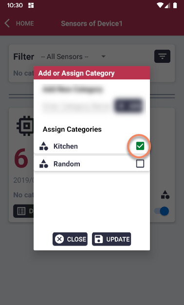
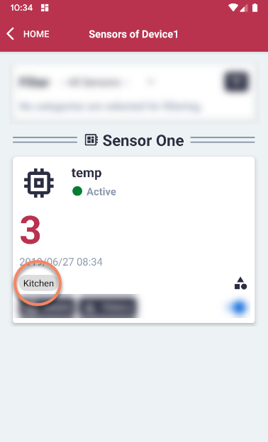

# Categorize Sensors

#### Please follow the steps described in the section 'Display Sensors of a Device' first.

#### For the relevant Sensor, click the 'Category Management' button on the right side of the category row.

#### Add a new category by filling out the field and clicking the 'Add' button.

#### The already added categories will be listed.

#### Select the checkbox for the category the sensor should be assigned to.

#### Then, click the 'Update' button to save changes.

#### On the overview, the assigned category for the sensor will now be displayed.

