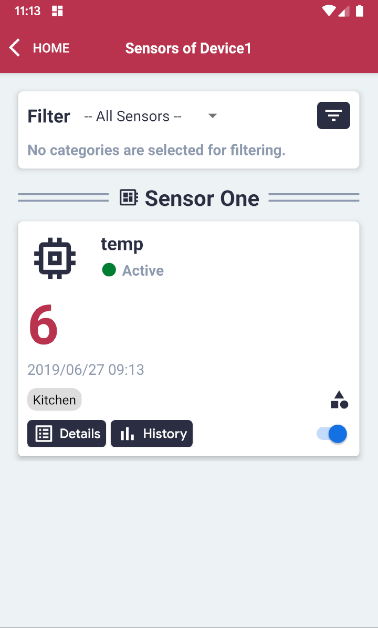
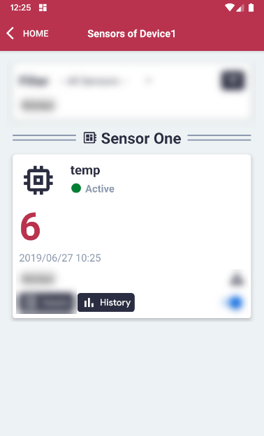
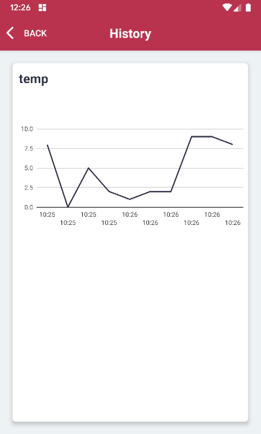

# Display Graph of Readings

#### Please follow the steps described in the section 'Display Sensors of a Device' first.

#### Click the 'History' button.

#### The Graph will be shown.
#### Note: The graph currently only shows the last 10 data sets. More options are coming soon.

