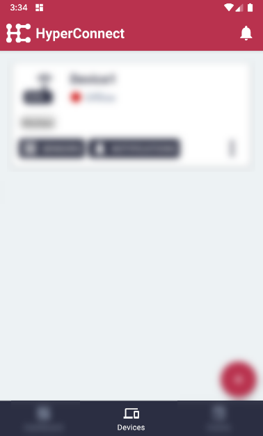
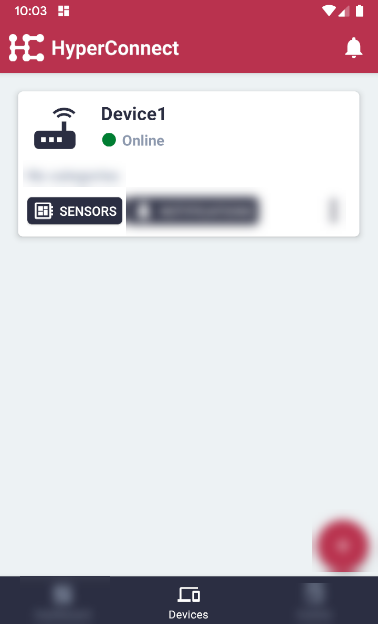
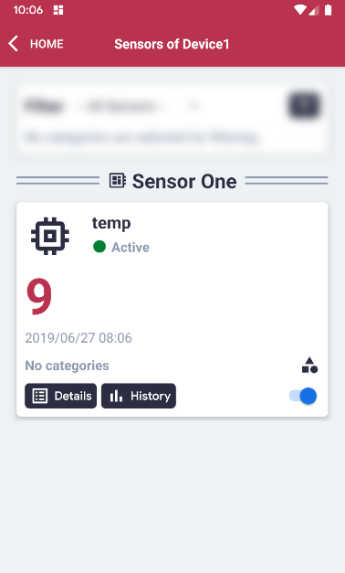

# Display Sensors of a Device

#### Click the 'Devices' menu item on the bottom in the middle.

#### For the relevant device, click the 'Sensors' button.

#### The Sensors will be listed by their Sensor Group, as grouped on the Edge Client.

