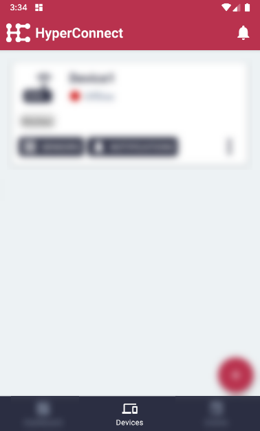
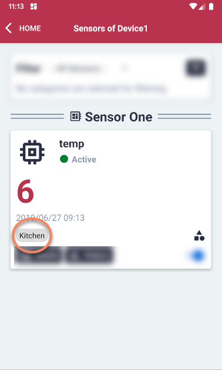
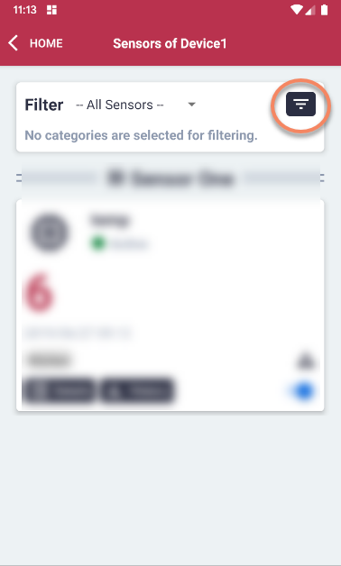
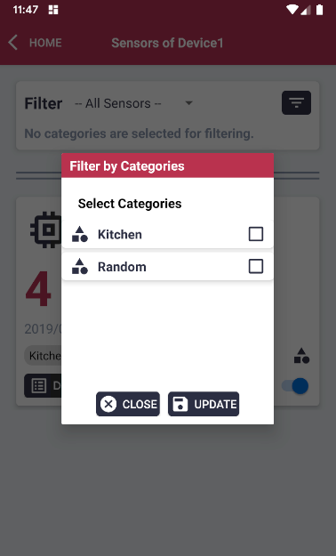
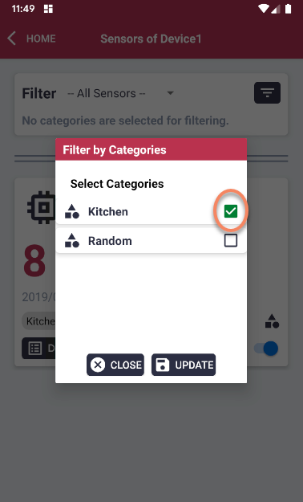
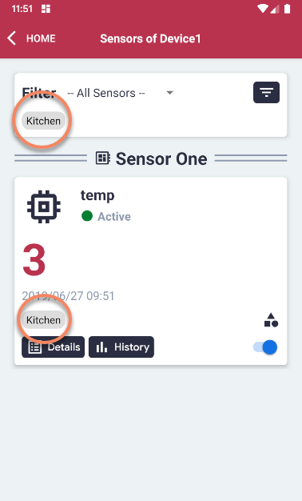
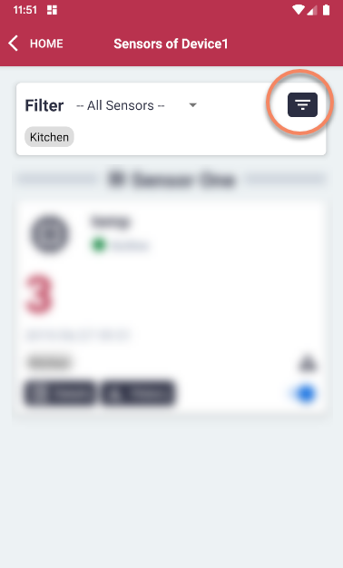
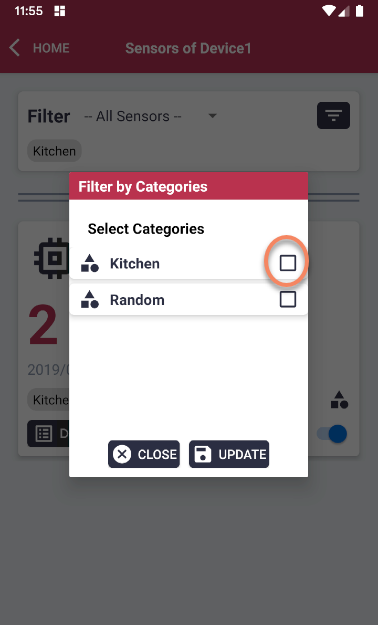

# Filter Sensors of a Device

#### Please follow the steps described in the section 'Display Sensors of a Device' first.

#### Make sure the sensors have been categorized before. If not, please follow the steps described in the section 'Categorize Sensors'.

#### In the Filter section, on the right side, click the 'Filter' button.

#### The list of available categories will appear.

#### Select a relevant category.
#### Note: In this example the only sensor is categorized as 'Kitchen'.

#### Click the 'Update' button.

#### The category will be added to the active filter.
#### Note: In this example the only sensor is categorized as 'Kitchen'.

#### To remove the filter, click the 'Filter' button.

#### Uncheck the selected categories and click 'Update'.

