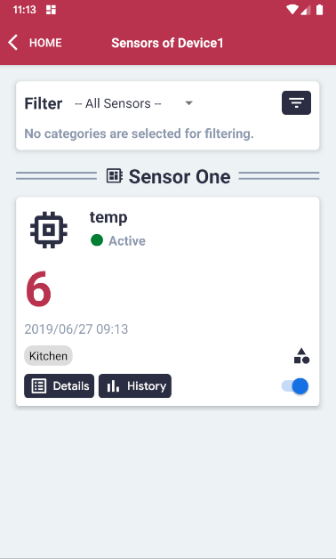
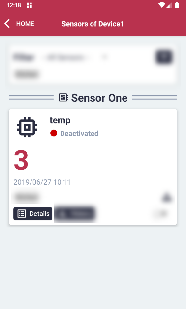
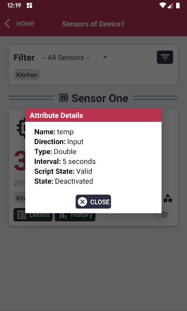

# Show Details of a Sensor

#### Please follow the steps described in the section 'Display Sensors of a Device' first.

#### Click the 'Details' button.

#### The sensor details will be displayed.
#### Note: These details are controlled by the Edge Client.

