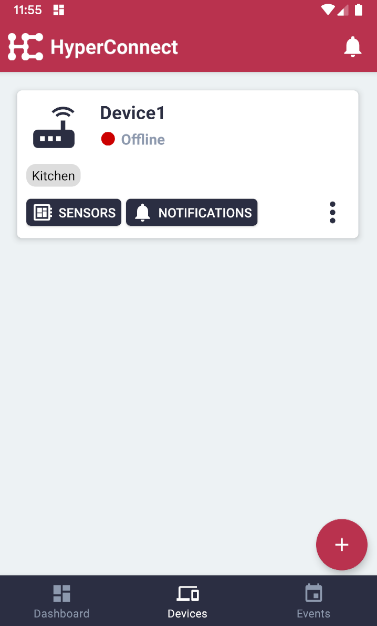
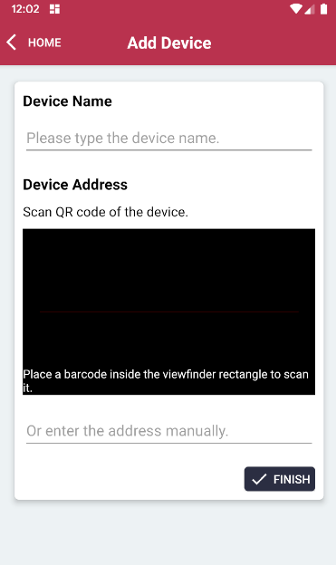

# Devices

### Device Overview

- **Name** - Descriptive Name of the device.
- **Status** - Connection Status: Offline / Online
- **Category** - Custom categories for Devices
- **Sensors** - Sensor Management
- **Notifications** - Notifications for selected device
- **More** - Edit or remove device
- **Add** - Add new device

### Add Device

**Device Name** - Descriptive Name of the device.

**Device Address** - Address of the Edge Client device to be added manually or by scanning the QR code

**Finish** - Connect to Edge Client and add to Remote Controller
