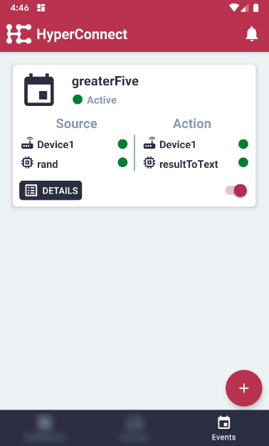
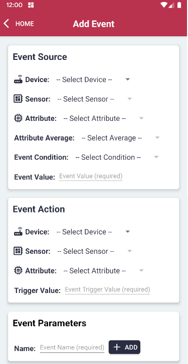

# Events

## Overview

## Add Event

### Event Source
- **Device**: Edge Client device
- **Sensor**: Sensor Group
- **Attribute**: Sensor Attribute for which input values will be monitored
- **Attribute Average**: Real-time vs Averaged values to be monitored
- **Event Condition**: Condition for value (equal to, not equal to, greater than, less than )
- **Event Value**: Value for condition to be fulfilled

### Event Action
- **Device**: Edge Client device
- **Sensor**: Sensor Group
- **Attribute**: Sensor Attribute for which output values will sent to
- **Trigger Value**: Output value to be set if condition is fulfilled

### Event Parameters
- **Name**: Name for event
- **Add**: Add / Save event
