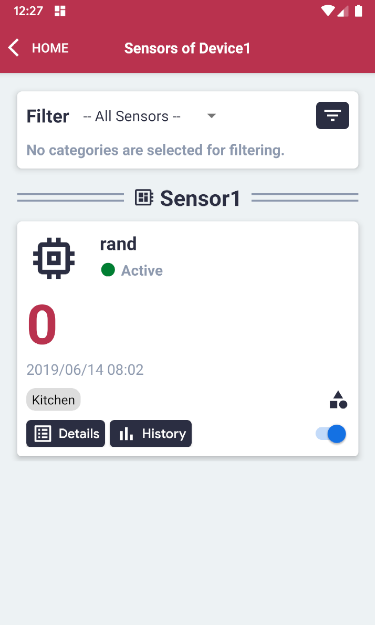
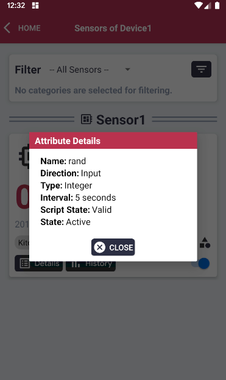

# Sensors

## Overview

- **Filter** - Sensors can be filtered by categories
- **Name** - Descriptive Name of the device.
- **Status** - Connection Status: Offline / Online
- **Reading Value** - Latest reading from sensor
- **Date and Time** - Date and time of reading from sensor
- **Category** - Custom categories for Sensors
- **Details** - Additional details for sensor
- **History** - Graph of latest readings

### Details

- **Name**: Name of Sensor Attribute
- **Direction**: Input (from sensor to device), Output (from device to sensor)
- **Type**: Type of data to be collected (string, boolean, integer, double)
- **Interval**: Interval between readings / Event-driven if 'Direction' is 'Output'
- **Script State**: valid / invalid
- **Sensor Attribute State**: active / deactivated (Script state must be valid to

### History
