# Raspberry Pi + SenseHat Temperature Sensor + LED Matrix with Local Events

In this tutorial an Input Sensor Attribute will be created, which will measure the actual temperature with a sensor on the Raspberry Pi SensHat

The Output Sensor Attribute will have the purpose of showing the letter 'H' for Hot and 'C' for Cold on the LED Matrix on the SenseHat.

The following situation should be handled:

- If the value from the Input Attribute is above a certain temperature, set the Output Attribute to 'H'.

- If the value from the Input Attribute is below a certain temperature, set the Output Attribute to 'C'.

Great, let's get started!

#### Open the 'Sensors' view.

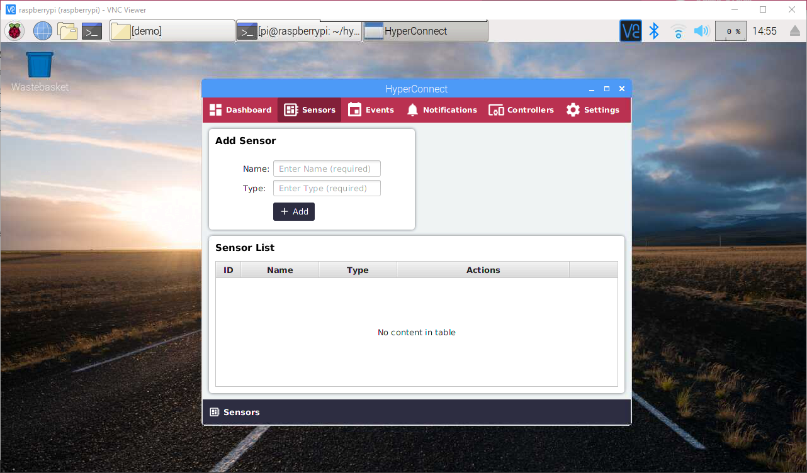

#### Enter the name 'Raspi' and type 'Raspberry Pi'. Click 'Add' to create the new Sensor Group.


#### The new Sensor Group 'Raspi' is added to the Sensor List. Click 'Configure' to add new Sensor Attributes.


#### By clicking 'Configure', the List of defined attributes appears as well as the 'Add Attribute' section.


#### Create a new attribute:
- Name: temp
- Type: double
- Direction: Input (from sensor to device)
- Interval: 5 sec


#### Click 'Add' to save the new attribute.


#### In the Sensor Attribute List, click the '< >'(Script) button.


#### Click the 'Edit' button to enable editing.

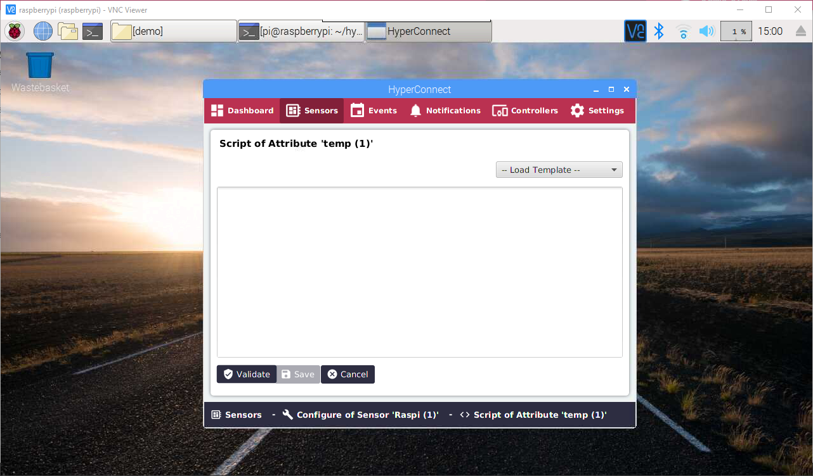

#### Add the following script:
```
from sense_hat import SenseHat

sense = SenseHat()
sense.clear()

temp = sense.get_temperature()
print(temp)
```

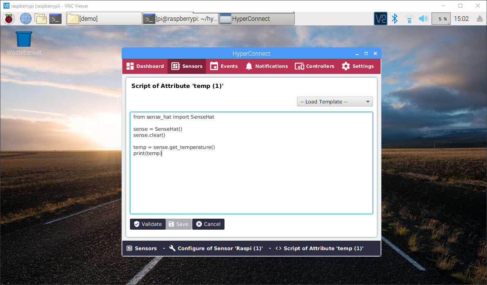

#### Click 'Validate'. The Python compiler will check if everything is correct.

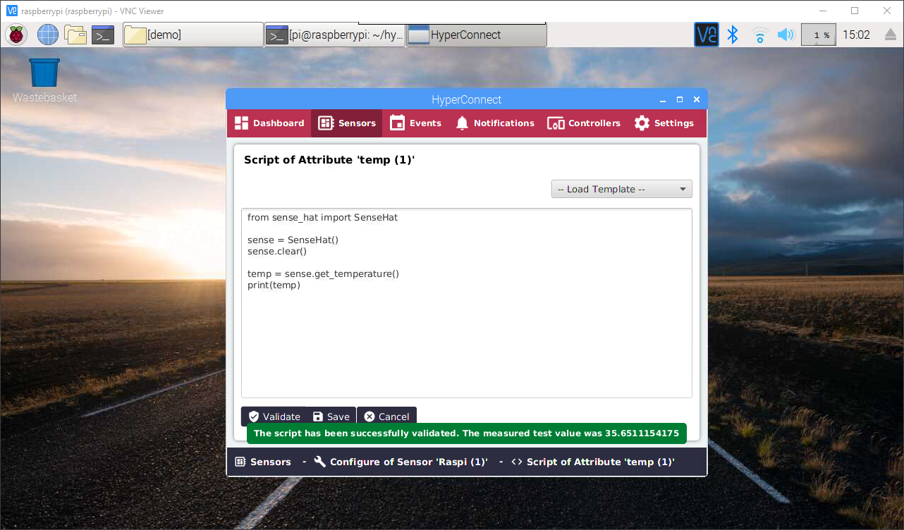

#### Click 'Save'. Then click 'Back to Attribute List'.

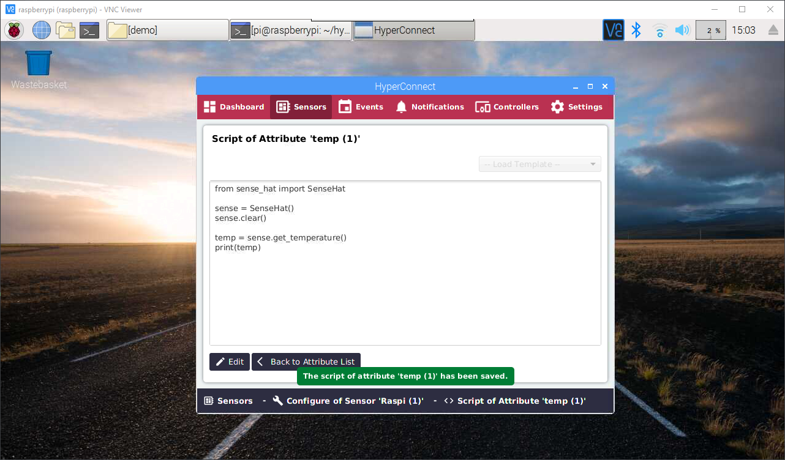

#### After click 'Back to Attribute List', the overview list will be shown.

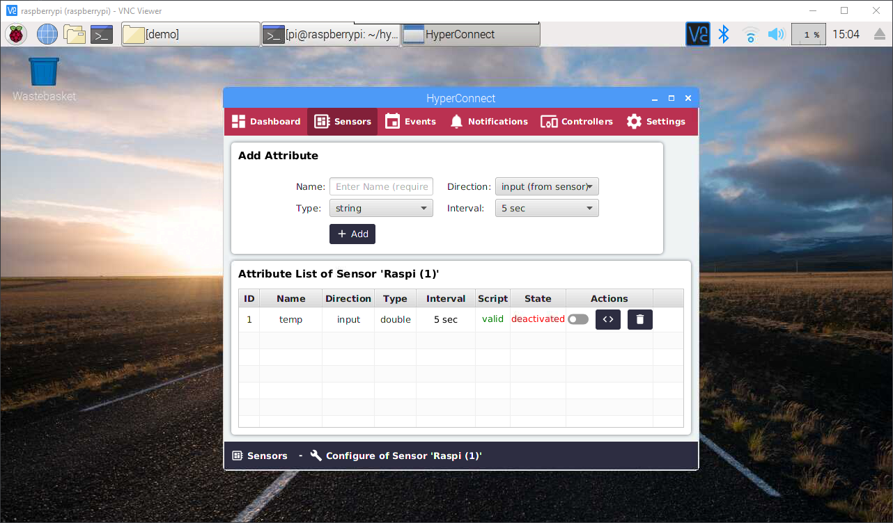

#### In the 'Add Attribute' section on top, add a new Attribute:
- Name: led
- Type: string
- Direction: output(device to sensor)
- Interval: Event-driven

#### Click 'Add'.


#### The 'led' attribute has been added successfully.
#### Click the '< >'(Script) button of the 'led' attribute.

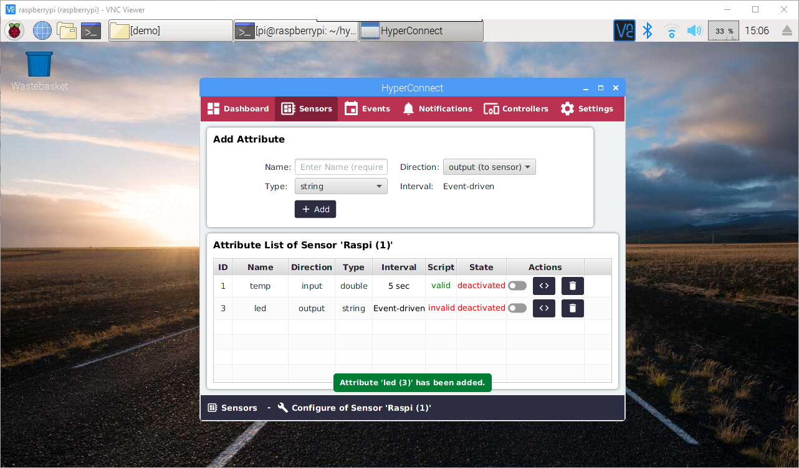

#### Click 'Edit' to enable editing.


#### Editing has been enabled if the 'Validate' button is visible.


#### Add the following script to the body:
```
import sys
parameter=sys.argv[1]

from sense_hat import SenseHat

sense=SenseHat()
sense.show_letter(parameter, text_colour=[255,0,0])

print("DONE")
```
#### Enter the Input Parameter: H

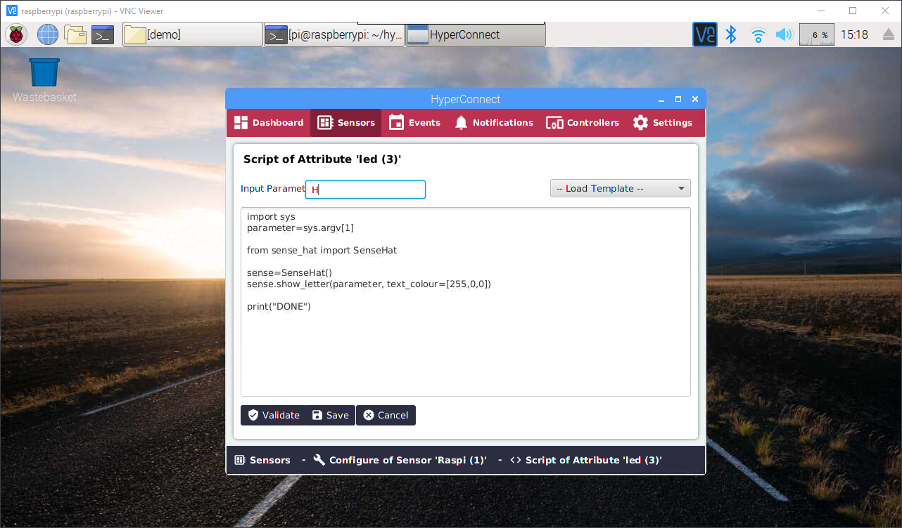

#### Click 'Validate'.
#### On the Raspberry Pi SenseHAT, the letter H will be shown on the LED matrix. This is for validation only.

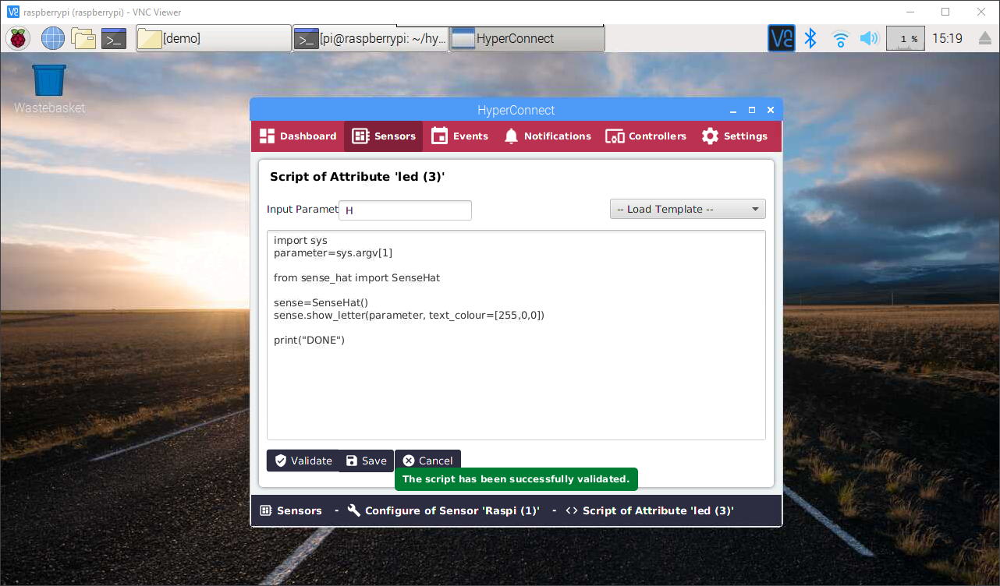

#### Save the changes and return to the Attribute List.

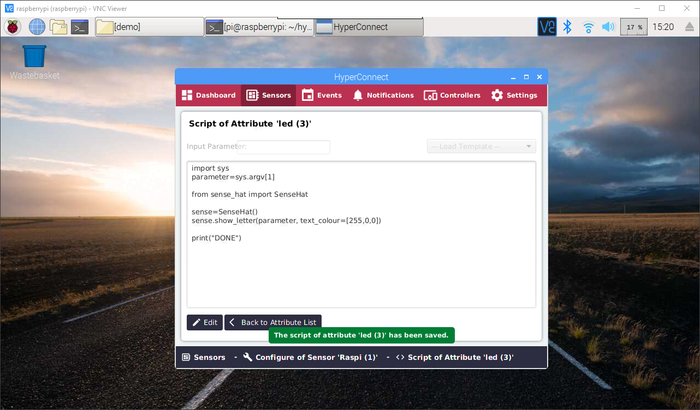

#### Activate both Attributes by clicking the switch in their rows.

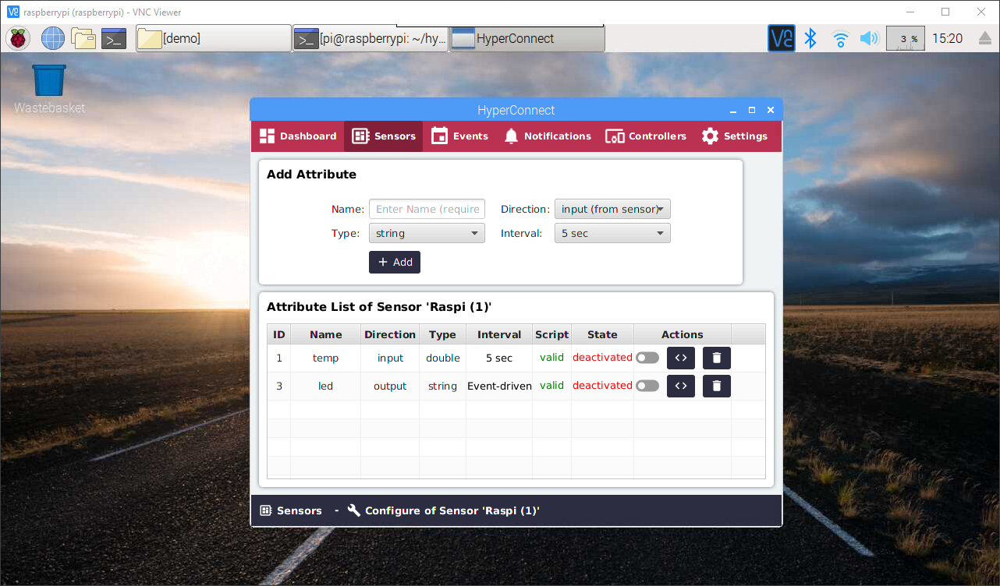

#### Let's check the read values of the input attribute.
#### Click 'Sensors' in the menu.

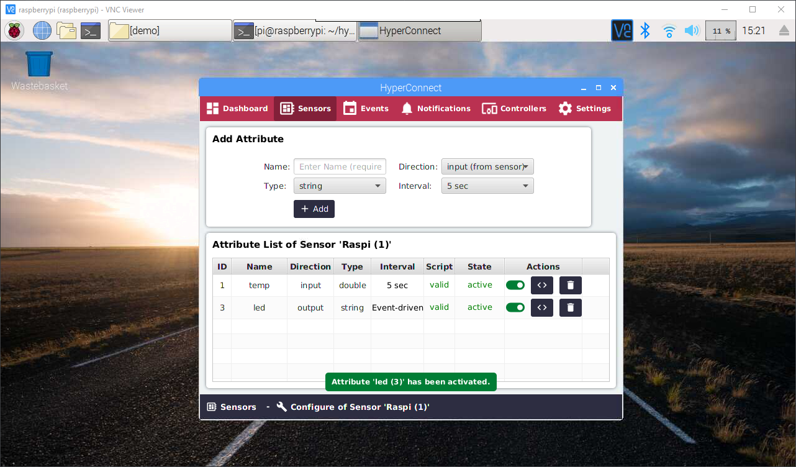

#### Click the 'Overview' button.

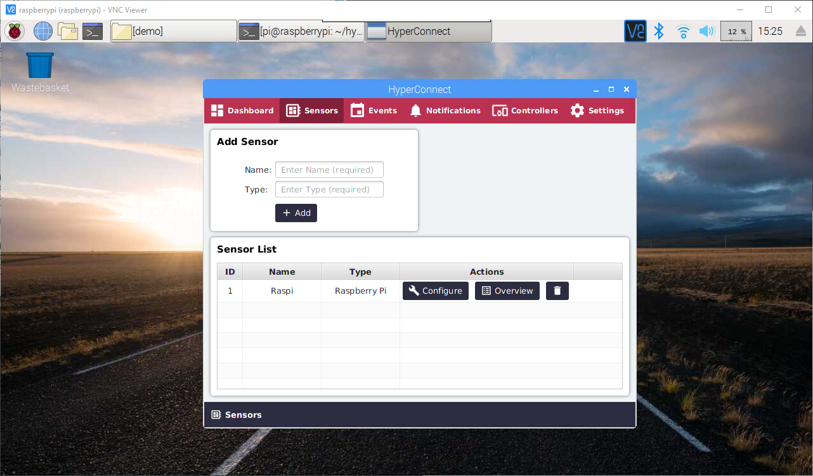

#### The Latest Value read was around 35.77 .


#### Click the 'Refresh' in the top right corner. The Latest Value read was around 35.74 . We will use this data to configure our events.


#### In the Menu, click 'Events'. Then click 'Add Event'.


#### Events consist of an Event Source and an Event Action.
- Event Sources are the values from Input Attributes.
- Event Actions are commands sent to the Output Attributes.


#### Select the following values:

##### Event Source
- Sensor: Raspi (Raspberry Pi)
- Attribute: temp (double)
- Attribute Average: Real-Time
- Event Condition: greater than
- Event Value: 37.5 (or similar, depending on the average temp on your device)

##### Event Action
- Sensor: Raspi (Raspberry Pi)
- Attribute: led (string)
- Trigger Value: H (for Hot)

##### Event Name
- Name: TempHot (or anything memorable)

#### Click 'Add' to save and return to overview.

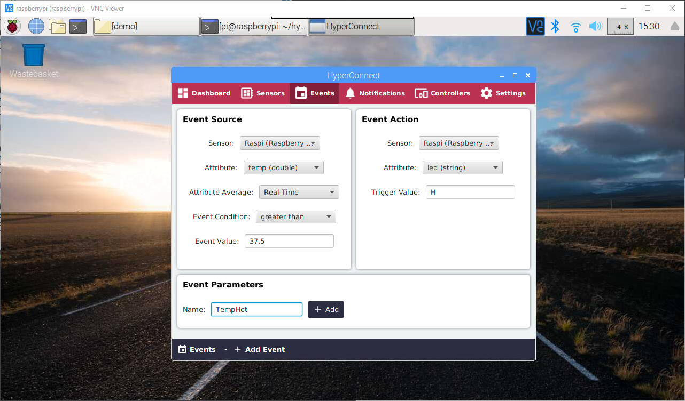

#### In the overview section, let's add a second event, in case the temp goes below 37.5 , how should the output value be set.

#### Click 'Add Event'.


#### Let's configure the new event.

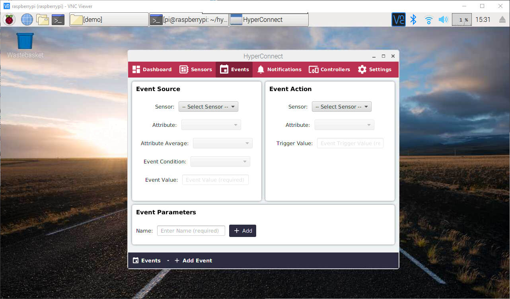

#### Select the following values:

##### Event Source
- Sensor: Raspi (Raspberry Pi)
- Attribute: temp (double)
- Attribute Average: Real-Time
- Event Condition: less than
- Event Value: 37.5 (or similar, depending on the average temp on your device)

##### Event Action
- Sensor: Raspi (Raspberry Pi)
- Attribute: led (string)
- Trigger Value: C (for Cold)

##### Event Name
- Name: TempCold (or anything memorable)

#### Click 'Add' to save the new event and return to the overview.


#### Great!


#### Let's activate both events by clicking the switches.

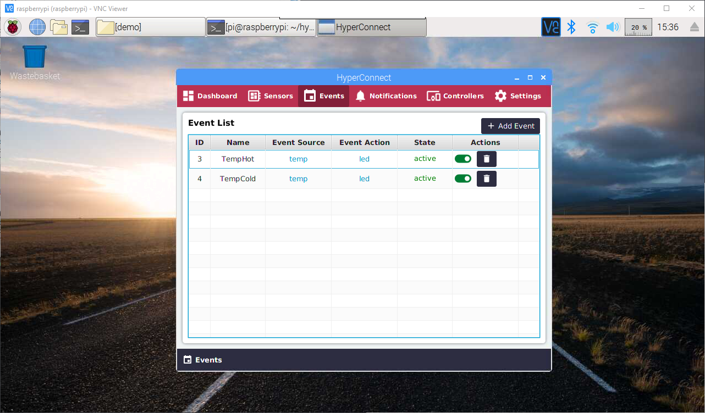

#### In case the temperature is above the defined 37.5 degrees, the Raspberry Pi will display the letter 'H'.

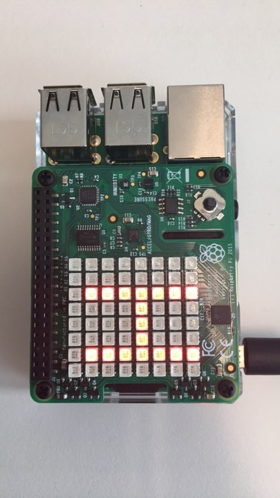

#### By blowing over the temperature sensor and lowering the temperature of the board, the Raspberry Pi will monitor the changes and will change the letter 'H' to the letter 'C'.

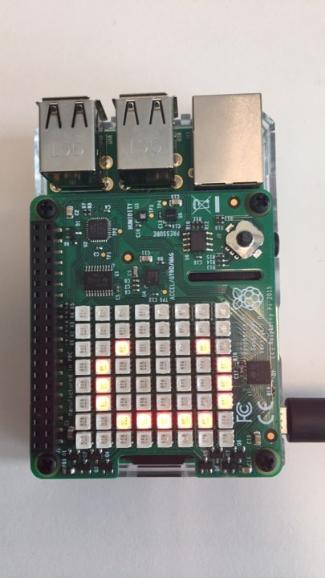

#### Excellent! Please feel free to post in the [Forum](https://forum.cyberrepublic.org/c/hyperconnect) if you have any questions or face any issues.
